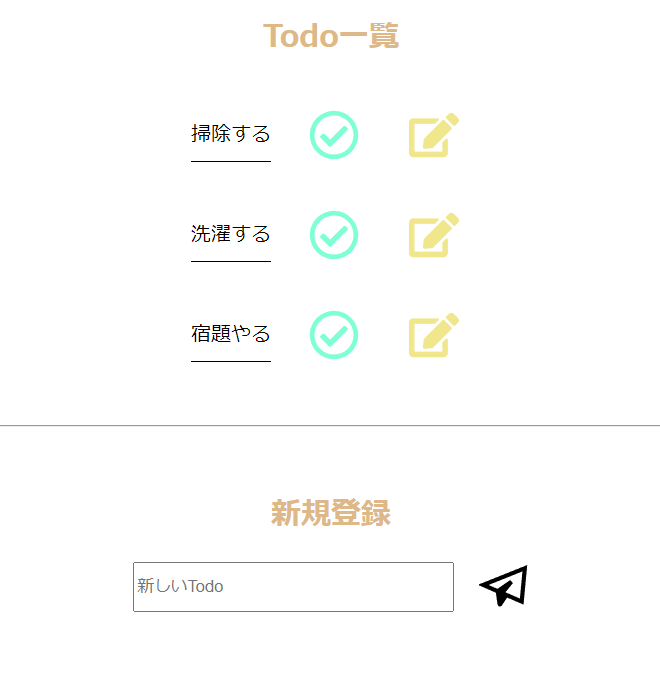

### Todo App
- Todoの登録 / 削除 / 編集
- データベースと連携
- レスポンシブなWebデザイン



### 使用技術
- `React`
- [json-server](https://github.com/typicode/json-server)
    - [axios](https://axios-http.com)でAPI操作
- [Vite](https://ja.vitejs.dev)
    - `React`のプロジェクト作成で使用
- [React icons](https://react-icons.github.io/react-icons/)
- [react-hot-toast](https://react-hot-toast.com)

### インストール
```bash
npm i json-server
npm i axios
npm i react-hot-toast
npm i react-icons --save
```

### Vite開発環境立ち上げ
```bash
npm run dev
```

### json-server立ち上げ
```bash
npm run js
```

### その他
- 主にsrc/components内にコードを記述